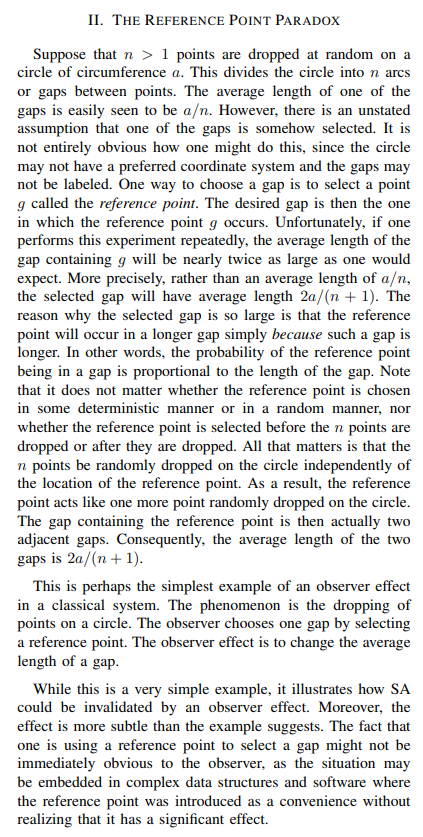

# The Observer Effect in Abelian Probability Theory
Simple Simulation for The Experiment of The Reference Point Paradox 


# Theory 
Baclawski, Kenneth. "The observer effect." In 2018 IEEE Conference on Cognitive and Computational Aspects of Situation Management (CogSIMA), pp. 83-89. IEEE, 2018.

<br/><br/>




# Code Run

### Uniform Distribution:
```bash
[-] Enter Circle Diameter (e.g. 50): 50
[-] Enter The Num of Arcs (e.g. 500): 500
[-] Enter The Number of Points that Will be Dropped (e.g. 100000): 100000
[-] Enter the distribution of random numbers (Beta/Uniform): uniform
[+] Actual Value: 0.1
[+] Simulation Result: 0.19896175186166512
[+] Therotical Simulation Result: 0.1996007984031936
```

### Beta Distribution:
```bash
[-] Enter Circle Diameter (e.g. 50): 50
[-] Enter The Num of Arcs (e.g. 500): 500
[-] Enter The Number of Points that Will be Dropped (e.g. 100000): 100000
[-] Enter the distribution of random numbers (Beta/Uniform): beta
[-] Alpha Parameter: 4
[-] Beta Parameter: 4
[+] Actual Value: 0.1
[+] Simulation Result: 0.400103967612772
[+] Therotical Simulation Result: 0.1996007984031936
```


### How to Do It Right in Practise? 

Instead of throwing points at the gaps in the circle, you should throw a dice or generate numbers to choose a specific arc. 


# Others 

- Girl or Boy Paradox
- The Inspection Paradox of RadioActive Sample
- The Prisoner (I don't agree much with this!)
- Sociological Observer Effect
- Schrodinger's Cat
- Software Monitring & Heisenbug

## Buy me a Coffee: 
BTC: bc1q2kqvggm552h0csyr0awa2zepdapxdqnacw0z5w


